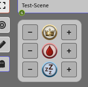
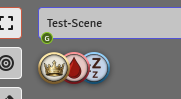

# Arga's Benny & Wound Panel (Foundry VTT, Version 13)

A floating widget for Savage Worlds Adventure Edition (SWADE) that lets you adjust

- Bennies
- Wounds, and
- Fatigue

on selected tokens without ever opening a character sheet. The module automatically detects the token type (character, NPC, group, vehicle) and adjusts the available controls accordingly.

  

## Moving the Widget

Grab the widget with the right mouse button and drag it wherever you like. Its position is saved and restored on reload.

There are two fixed docking points: the **Active Players** window (bottom-left) and the **Scene Navigation Bar** (top-left). As the widget approaches either of these areas, it will wiggle to indicate a valid dock position — release it there and it snaps into place, following along whenever those panels expand or collapse.

Outside of dock zones, the widget will snap to the hotbar, the sidebar, or the edges of the canvas.

If **Arga's Day-Night Slider** is also installed, the slider becomes an additional docking point (see below).

## Minimizing the Widget

Double-click any of the three icons (Bennies, Wounds, Fatigue) to collapse the widget into a small compact icon. The compact icon can be dragged around independently with the right mouse button, and double-clicking it restores the full widget.

  

The compact icon remembers its own position separately from the widget. If you are short on space, the compact icon can also be displayed vertically — toggle this in the module settings.

## Settings & Appearance

The widget automatically adapts to UI scaling, the faded-UI setting, and light or dark interface themes. Beyond that, a number of options can be configured in the Game Settings, including whether chat messages should be detailed, brief, or turned off entirely. Disabling chat output is a GM-only setting.

## Languages

The module is currently available in English and German.

## Compatibility with Other Modules

- **Arga's Day-Night Slider** — The two widgets dock to each other and move together when a shared docking point expands (e.g. the Scene Navigation Bar).
- **Dice So Nice** — Spending and receiving Bennies triggers a DSN dice animation.

---

*Enjoy — Arga*
